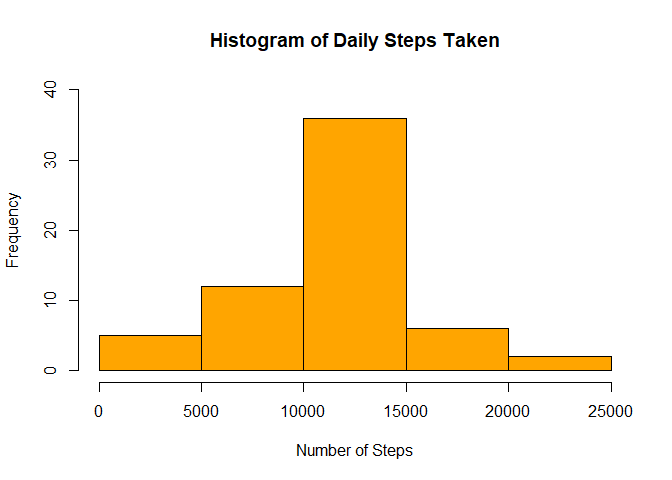
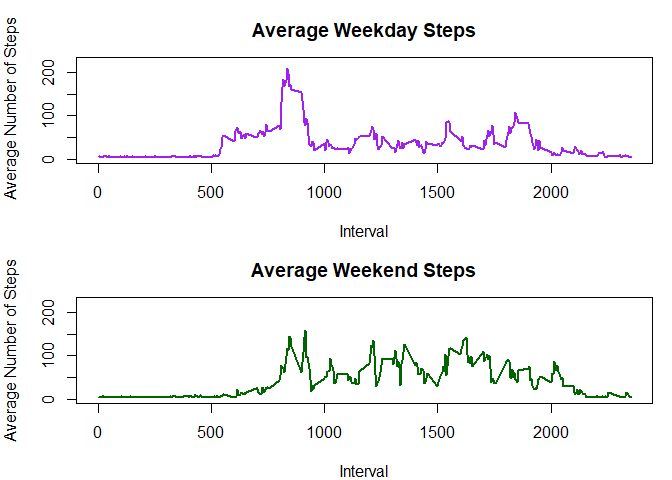

Introduction
============

It is now possible to collect a large amount of data about personal
movement using activity monitoring devices such as a Fitbit, Nike
Fuelband, or Jawbone Up.

This assignment makes use of data from a personal activity monitoring
device. This device collects data at 5 minute intervals through out the
day. The data consists of two months of data from an anonymous
individual collected during the months of October and November, 2012 and
include the number of steps taken in 5 minute intervals each day.

Read in Data
============

The data for this assignment can be downloaded from the course web site:

Dataset: [Activity monitoring
data](https://d396qusza40orc.cloudfront.net/repdata%2Fdata%2Factivity.zip)
\[52K\] The variables included in this dataset are:

steps: Number of steps taking in a 5-minute interval (missing values are
coded as NA)

date: The date on which the measurement was taken in YYYY-MM-DD format

interval: Identifier for the 5-minute interval in which measurement was
taken

The dataset is stored in a comma-separated-value (CSV) file and there
are a total of 17,568 observations in this dataset.

    library(dplyr)
    library(tidyr)
    library(data.table)
    library(Hmisc)
    setwd("C:/Users/Wayne Office Laptop/Documents/GitHub/personal-Activity-Monitoring---Peer-Graded-Assignment-")
    fileURL <- "https://d396qusza40orc.cloudfront.net/repdata%2Fdata%2Factivity.zip"
    download.file(fileURL,destfile = "./activity.zip")
    unzip(zipfile ="./activity.zip")
    pathdata <- "./"
    list.files("./")

    ## [1] "activity.csv"       "activity.zip"       "doc"               
    ## [4] "finalActivity.R"    "instructions_fig"   "PA1_template.html" 
    ## [7] "PA1_template.md"    "PA1_template.Rmd"   "PA1_template_files"

    # read data
    activityData <- fread("activity.csv",na.strings = c("NA"))

Transform and Explore Data
==========================

#### Remove missing data, change variable attributes.

    # data before transform
    str(activityData)

    ## Classes 'data.table' and 'data.frame':   17568 obs. of  3 variables:
    ##  $ steps   : int  NA NA NA NA NA NA NA NA NA NA ...
    ##  $ date    : chr  "2012-10-01" "2012-10-01" "2012-10-01" "2012-10-01" ...
    ##  $ interval: int  0 5 10 15 20 25 30 35 40 45 ...
    ##  - attr(*, ".internal.selfref")=<externalptr>

    actDataNoNa <- activityData %>%
            drop_na(steps)
    #make date from character to a date type
    actDataNoNa$date <- as.Date(actDataNoNa$date, "%Y-%m-%d")
    str(actDataNoNa)

    ## Classes 'data.table' and 'data.frame':   15264 obs. of  3 variables:
    ##  $ steps   : int  0 0 0 0 0 0 0 0 0 0 ...
    ##  $ date    : Date, format: "2012-10-02" "2012-10-02" ...
    ##  $ interval: int  0 5 10 15 20 25 30 35 40 45 ...
    ##  - attr(*, ".internal.selfref")=<externalptr>

#### What is mean total number of steps taken per day ingnoring missing values?

    #Calculate the total number of steps taken per day
    actDataStepsDay <- actDataNoNa %>%
            group_by(date)%>%
            summarise(totalSteps = sum(steps))
    head(actDataStepsDay)

    ## # A tibble: 6 x 2
    ##         date totalSteps
    ##       <date>      <int>
    ## 1 2012-10-02        126
    ## 2 2012-10-03      11352
    ## 3 2012-10-04      12116
    ## 4 2012-10-05      13294
    ## 5 2012-10-06      15420
    ## 6 2012-10-07      11015

#### Histogram of the total number of steps taken each day.

    hist(actDataStepsDay$totalSteps, col = 'Blue',xlab = "Number of Steps",
         main = "Histogram of Daily Steps Taken", ylim = c(0,40))

#### Calculate and report the mean and median steps per day.

    rawMean <- mean(actDataStepsDay$totalSteps)
    rawMedian <- median(actDataStepsDay$totalSteps)
    raw <- cbind(rawMean,rawMedian)
    raw

    ##       rawMean rawMedian
    ## [1,] 10766.19     10765

Mean Steps is 10766.19. Median Steps is 10765.

#### What is the average daily activity pattern?

#### Make a time series plot of the 5 min intervals (x-axis), and average number of steps across all days (y-axis).

    actDataStepsInterval <- actDataNoNa %>%
            group_by(interval)%>%
            summarise(totalSteps = mean(steps))
    #plot time series of the median steps for each day
    plot(actDataStepsInterval$interval,actDataStepsInterval$totalSteps, type = "l",
         col="green", ylab = "Average Steps Taken", xlab = "Time Interval",
         lwd=2, ylim = c(0,300), main=" Average Steps per 5 min Interval")

#### Which 5-minute interval, on average across all the days in the dataset, contains the maximum number of steps?

    maxInterval <- filter(actDataStepsInterval,totalSteps==max(totalSteps))
    maxInterval

    ## # A tibble: 1 x 2
    ##   interval totalSteps
    ##      <int>      <dbl>
    ## 1      835   206.1698

Interval 835 has the max number of steps of 206.1698.

Imputing Missing Values
=======================

There are a number of days/intervals where there are missing values
(coded as NA). The presence of missing days may introduce bias into some
calculations or summaries of the data.

#### Calculate and report the total number of missing values in the dataset (i.e. the total number of rows with NAs).

    sum(is.na(activityData)==TRUE)

    ## [1] 2304

    # percentage of missing data
    mean(is.na(activityData$steps))

    ## [1] 0.1311475

There are 2304 missing step data or about 13% of the step data is
missing.

#### Devise a strategy for filling in all of the missing values in the dataset.

The strategy is to fill missing data with mean steps using the Hmisc
package.

#### Create a new dataset that is equal to the original dataset but with missing data filled in.

Added a imputedMean Steps column.

    actDataImpute <- activityData
    actDataImpute$imputedMeanSteps <- with(actDataImpute,impute(steps,mean))
    actDataImpute$date <- as.Date(actDataImpute$date, "%Y-%m-%d")
    head(actDataImpute)

    ##    steps       date interval imputedMeanSteps
    ## 1:    NA 2012-10-01        0          37.3826
    ## 2:    NA 2012-10-01        5          37.3826
    ## 3:    NA 2012-10-01       10          37.3826
    ## 4:    NA 2012-10-01       15          37.3826
    ## 5:    NA 2012-10-01       20          37.3826
    ## 6:    NA 2012-10-01       25          37.3826

The result is each NA was replaced with the mean value of 37.3826.

#### Make a histogram of the total number of steps taken each day.

    actDataStepsImpute<- actDataImpute %>%
            group_by(date)%>%
            summarise(totalSteps = sum(imputedMeanSteps))
    head(actDataStepsImpute)

    ## # A tibble: 6 x 2
    ##         date totalSteps
    ##       <date>      <dbl>
    ## 1 2012-10-01   10766.19
    ## 2 2012-10-02     126.00
    ## 3 2012-10-03   11352.00
    ## 4 2012-10-04   12116.00
    ## 5 2012-10-05   13294.00
    ## 6 2012-10-06   15420.00

    # Plot histogram
    hist(actDataStepsImpute$totalSteps, col = 'Orange',xlab = "Number of Steps",
         main = "Histogram of Daily Steps Taken", ylim = c(0,40)) 

#### Calculate and report the mean and median of the imputed steps data.

    imputeMean <- mean(actDataStepsImpute$totalSteps)
    imputeMedian <- median(actDataStepsImpute$totalSteps)
    imputed <- cbind(imputeMean,imputeMedian)
    imputed

    ##      imputeMean imputeMedian
    ## [1,]   10766.19     10766.19

Mean Steps is 10766.19. Median Steps is 10766.19

#### What is the impact of imputing missing data?

    Differencemean <- rawMean - imputeMean
    DifferenceMedian <- abs(rawMedian-imputeMedian)
    Difference  <- cbind(Differencemean,DifferenceMedian)
    raw_imputed <- as.data.frame(rbind(raw,imputed,Difference))

    colnames(raw_imputed) <- c("Mean", 'Median')
    rownames(raw_imputed) <- c("Raw Data","Imputed Data", "Difference")

    raw_imputed

    ##                  Mean       Median
    ## Raw Data     10766.19 10765.000000
    ## Imputed Data 10766.19 10766.188679
    ## Difference       0.00     1.188679

The mean between imputed data, and data where NAs are ignored remained
the same, while the median value increased 1.2 steps.

Comparing Weekday and Weekend Activity.
=======================================

Are there differences in activity patterns between weekdays and
weekends?

#### Create a new factor variable in the dataset with two levels"weekday" and "weekend" and

    wdays<-c('Monday','Tuesday','Wednesday','Thursday','Friday')
    imputedActivityDataStepsInt <- actDataImpute 
    imputedActivityDataStepsInt$dayofweek <- 
            factor((weekdays(imputedActivityDataStepsInt$date)%in%wdays),
                   levels = c(TRUE,FALSE), labels = c('Weekday','Weekend'))
    head(imputedActivityDataStepsInt)

    ##    steps       date interval imputedMeanSteps dayofweek
    ## 1:    NA 2012-10-01        0          37.3826   Weekday
    ## 2:    NA 2012-10-01        5          37.3826   Weekday
    ## 3:    NA 2012-10-01       10          37.3826   Weekday
    ## 4:    NA 2012-10-01       15          37.3826   Weekday
    ## 5:    NA 2012-10-01       20          37.3826   Weekday
    ## 6:    NA 2012-10-01       25          37.3826   Weekday

    meanInterval <- aggregate(imputedMeanSteps ~ interval + dayofweek, 
                              imputedActivityDataStepsInt, FUN = mean)
    head(meanInterval)

    ##   interval dayofweek imputedMeanSteps
    ## 1        0   Weekday         7.006569
    ## 2        5   Weekday         5.384347
    ## 3       10   Weekday         5.139902
    ## 4       15   Weekday         5.162124
    ## 5       20   Weekday         5.073235
    ## 6       25   Weekday         6.295458

    #create weekday and weekend step data views for plotting
    stepsWD<-meanInterval %>%
            filter(dayofweek=='Weekday')

    stepsWE <- meanInterval %>% 
            filter(dayofweek=='Weekend')

#### Create time series plots for weekday and weekend activity.

    # plot weekdays
    par(mfrow=c(2,1))
    par(mar=c(4,4,3,1))
    plot(stepsWD$interval,stepsWD$imputedMeanSteps, type = "l",
         lwd = 2, ylim = c(0,225), main = "Average Weekday Steps",
         ylab = " Average Number of Steps", xlab = "Interval", col = "purple")

    #plot weekends
    plot(stepsWE$interval,stepsWE$imputedMeanSteps, type = "l",
         lwd = 2, ylim = c(0,225), main = "Average Weekend Steps",
         ylab = "Average Number of Steps", xlab = "Interval", col = "dark green")

Based on the plots, there is relatively more weekend activity compared
to weekday activity.
